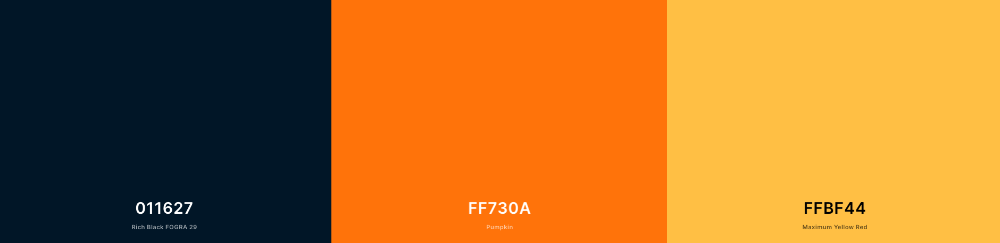
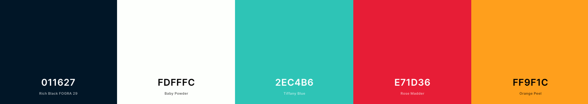

<div align="center">
  <a href="https://dayl.om.nom.es" rel="nofollow">
    
    </a>
  </a>
</div>
<br/>
<p align="center">
Daily logs, made easy
</p>

----

## First Steps

#### Install dependencies

Instal Symfony CLI:
````bash
# https://symfony.com/download
curl -sS https://get.symfony.com/cli/installer | bash
````

PHP Dependencies:
```bash
composer install
```

Javascript Dependencies:
```bash
yarn install
# or
npm install
```

#### Configure de enviroment

In this project there are two `.env` files, one for the front side, and another one for the backend part.

`.env` and `assets/js/.env`

The code is shipped with the `.env.dist` version of these files, so you need to fill the vars.

Some vars you may want to change:
```
# .env
DATABASE_URL
GOOGLE_API_KEY
GOOGLE_API_SECRET

# ./assets/js/.env
API_URL
GOOGLE_API_KEY
GOOGLE_API_SECRET
```

#### Creating keys for JWT

_Documentation from jwt-authentication-bundle bundle_
````bash
mkdir -p config/jwt
openssl genpkey -out config/jwt/private.pem -aes256 -algorithm rsa -pkeyopt rsa_keygen_bits:4096
openssl pkey -in config/jwt/private.pem -out config/jwt/public.pem -pubout
````

#### Preapare de databse

Create the databse
```bash
 ./bin/console doctrine:database:create
``` 

Run the migrations
```bash
 ./bin/console doctrine:migrations:migrate 
``` 

Run the fixtures
```bash
 ./bin/console doctrine:fixtures:load
``` 

#### Run the project

Initialize Backend:
```bash
symfony serve --no-tls
```

Initialize Frontend:
````bash
yarn watch
````

---

## Design notes

#### Logo

| Color                 |  HEX	    |  Usage        | 
|---	                |---	    |---	        |
| Rich Black  	        |  #011627	| Text Color    |
| Punpkin     	        |  #FF730A	| Logo Gradient |
| Maximum Yellow Red 	|  #FFBF44  | Logo Gradient |



#### Fonts

| Font                  | Usage	        |  Link         | 
|---	                |---	        |---	        |
| Cabin                 | Logo Text     | [Here](https://fonts.google.com/specimen/Cabin?preview.text_type=custom)             |
|                       | Headings      | [Here](#)             |
|                       | Content       | [Here](#)             |

#### Colors

| Color         |  HEX	    | 
|---	        |---	    |
| Rich Black  	|  #011627	| 
| Baby Powder  	|  #FDFFFC 	| 
| Tiffany Blue  |  #2EC4B6 	| 
| Rose Madder  	|  #E71D36 	| 
| Orange Peel  	|  #FF9f1C  | 



