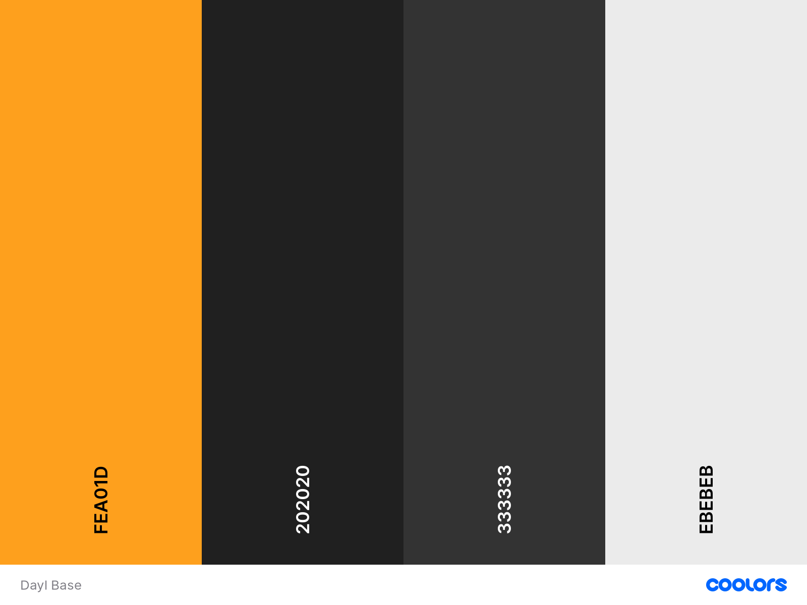

# About Design

## Logo

#### Regular

#### Dark

#### Minimal

#### Squared 

| Color                 |  HEX	    |  Usage        | 
|---	                |---	    |---	        |
| Mine Shaft   	        |  #202020	| Text Color    |
| Gallery   	        |  #F5F5F5	| Text Color    |
| Punpkin     	        |  #FF730A	| Logo Gradient |
| Maximum Yellow Red 	|  #FFBF44  | Logo Gradient |

## Fonts

| Font                  | Usage	        |  Link         | 
|---	                |---	        |---	        |
| Cabin                 | Logo Text     | [Here](https://fonts.google.com/specimen/Cabin?preview.text_type=custom)             |
| Montserrat            | Headings      | [Here](https://fonts.google.com/specimen/Montserrat?query=montserrat&preview.text=dayl&preview.text_type=custom)             |
| Roboto                | Content       | [Here](https://fonts.google.com/specimen/Roboto?query=roboto&preview.text=dayl&preview.text_type=custom)             |

## Colors

| Color         |  HEX	    | 
|---	        |---	    |
| Gallery     	|  #F5F5F5	| 
| Baby Powder  	|  #FDFFFC 	| 
| Gallery     	|  #F5F5F5 	| 
| Platinium  	|  #EBEBEB 	| 
| Orange Peel  	|  #FF9f1C  | 
| Mine Shaft  	|  #202020  | 
| Mine Shaft  	|  #333333  | 

